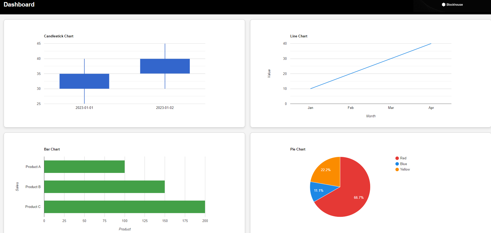

# Next.js Dashboard

This is a simple, responsive dashboard built with Next.js and Google Charts, integrated with a Django API backend. The dashboard displays various types of charts, including candlestick, line, bar, and pie charts, with responsive design and error handling.

## Installation

### Prerequisites
- Python (with pip)

### Setup Instructions

1. **Clone the Repository**:
   ```bash
   git clone <repository_url>
   cd <repository_directory>

2. **Install Dependencies**:
   pip install django djangorestframework


3. **Run Application with Docker**:
   docker-compose up

4. **Access Application**:
   http://localhost:8000

5. **Test Application**:
   python manage.py test


**Libraries and Tools Used**:
Django REST framework: Backend framework to serve API data.
Docker: Containerization for consistent development and deployment environments.




