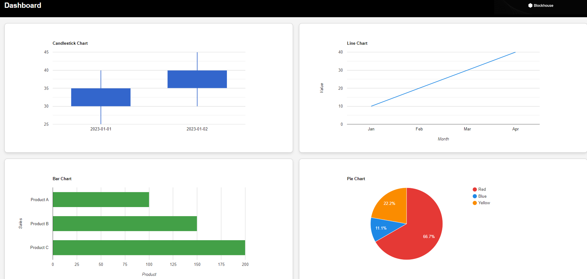

# Next.js Dashboard

This is a simple, responsive dashboard built with Next.js and Google Charts, integrated with a Django API backend. The dashboard displays various types of charts, including candlestick, line, bar, and pie charts, with responsive design and error handling.

## Installation

### Prerequisites
- Node.js
- Docker

### Setup Instructions

1. **Clone the Repository**:
   ```bash
   git clone <repository_url>
   cd <repository_directory>

2. **Install Dependencies**:
   cd frontend
   npm install

3. **Run Application**:
   npm run dev

4. **Run Application with Docker**:
   docker-compose up

5. **Access Application**:
   http://localhost:3000


**Libraries and Tools Used**:
Next.js: Framework for the frontend.
React: JavaScript library for building user interfaces.
Google Charts: Used for rendering various chart types.
Django: Backend framework to serve API data.
Axios: For making HTTP requests to the backend.
Docker: Containerization for consistent development and deployment environments.

**Approach and Thought Process**:
When I first looked at the problem, I decided to start with the backend, focusing on creating a robust and scalable application with REST endpoints. I ensured these endpoints were thoroughly tested and executed within a Docker environment, which provides a consistent and reliable setup across different development and production environments.

Once the backend was solidified, I transitioned to working on the UI. To enhance modularity and scalability, I created separate components for each graph. This approach not only makes the codebase easier to maintain but also allows for future expansion if additional charts or features are needed.

For the charting library, I chose Google Charts due to its ease of use and flexibility in integrating with React applications. After integrating the charts, I focused on error handling, specifically addressing scenarios where the backend might be down. This ensures the application can gracefully inform the user of any issues, maintaining a professional user experience.

In terms of design, I aimed for a clean and professional theme, ensuring that each chart had a consistent look and feel while using different colors to make the data visually appealing. The final product is a testable, scalable, and reliable application with end-to-end APIs running in Docker, comprehensive error handling, and a responsive design that adjusts to various screen sizes. This setup not only meets the requirements but also ensures a seamless user experience and ease of future development.




